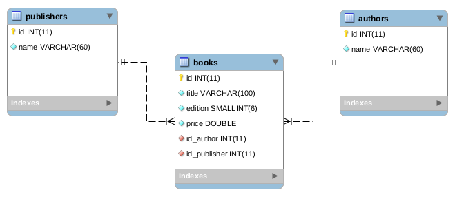

## About
The project shows how use the Hibernate ORM to manipulate a one-to-many relationship.

## Technologies
The following technologies were used in this project:

* [Java Oracle](https://www.oracle.com/java/)
* [Apache Maven](https://maven.apache.org/)
* [MySQL Server](https://www.mysql.com/)
* [Hibernate ORM](https://hibernate.org/orm/)
* [IDE Eclipse](https://www.eclipse.org/)

## Starting the project

### Clonning the project
```
$ git clone https://github.com/erosvitor/hibernate-1-n.git

$ cd hibernate-1-n
```

### Creating the database


The above database must be created using the following command:

```
CREATE SCHEMA hibernate1n DEFAULT CHARACTER SET utf8 COLLATE utf8_bin;

USE hibernate1n;

CREATE TABLE authors
(
  id INTEGER NOT NULL AUTO_INCREMENT,
  name VARCHAR(60) NOT NULL,
  PRIMARY KEY(id)
);

CREATE TABLE publishers
(
  id INTEGER NOT NULL AUTO_INCREMENT,
  name VARCHAR(60) NOT NULL,
  PRIMARY KEY(id)
);

CREATE TABLE books
(
  id INTEGER NOT NULL AUTO_INCREMENT,
  title VARCHAR(100) NOT NULL,
  edition SMALLINT NOT NULL,
  price DOUBLE NOT NULL,
  id_author INTEGER NOT NULL,
  id_publisher INTEGER NOT NULL,
  PRIMARY KEY (id),
  CONSTRAINT fk_books_authors
    FOREIGN KEY (id_author)
    REFERENCES authors(id) ON DELETE RESTRICT ON UPDATE RESTRICT,
  CONSTRAINT fk_books_publishers
    FOREIGN KEY (id_publisher)
    REFERENCES publishers(id)
);
```

Run the following commands to populate the demo database:

```
INSERT INTO authors (id, name) VALUES (1, 'Herbert Schildt');
INSERT INTO authors (id, name) VALUES (2, 'Erich Gamma');
INSERT INTO authors (id, name) VALUES (3, 'Grady Booch');
INSERT INTO authors (id, name) VALUES (4, 'Gordon Bell');
INSERT INTO authors (id, name) VALUES (5, 'Carlos Eduardo Vazquez');
INSERT INTO authors (id, name) VALUES (6, 'Robert C. Martin');
INSERT INTO authors (id, name) VALUES (7, 'Ian Stewart');
INSERT INTO authors (id, name) VALUES (8, 'Keith Devlin');
INSERT INTO authors (id, name) VALUES (9, 'Sun Tzu');

INSERT INTO publishers (id, name) VALUES (1, 'Makron Books');
INSERT INTO publishers (id, name) VALUES (2, 'Editora Moderna');
INSERT INTO publishers (id, name) VALUES (3, 'Bookman');
INSERT INTO publishers (id, name) VALUES (4, 'Editora Campus');
INSERT INTO publishers (id, name) VALUES (5, 'Elsevier');
INSERT INTO publishers (id, name) VALUES (6, 'Editora Érica');
INSERT INTO publishers (id, name) VALUES (7, 'Alta Books');
INSERT INTO publishers (id, name) VALUES (8, 'Zahar');
INSERT INTO publishers (id, name) VALUES (9, 'Record');
INSERT INTO publishers (id, name) VALUES (10, 'Jardim dos books');

INSERT INTO books (id, title, edition, price, id_author, id_publisher) VALUES (1, "C Completo e Total", 3, 310.00, 1, 1);
INSERT INTO books (id, title, edition, price, id_author, id_publisher) VALUES (2, "C++ Guia para iniciantes", 1, 150.30, 1, 2);
INSERT INTO books (id, title, edition, price, id_author, id_publisher) VALUES (3, "Java para iniciantes", 6, 195.50, 1, 3);
INSERT INTO books (id, title, edition, price, id_author, id_publisher) VALUES (4, "Padrões de projeto - Soluções reutilizáveis", 1, 97.90, 2, 3);
INSERT INTO books (id, title, edition, price, id_author, id_publisher) VALUES (5, "UML Guia do usuário", 1, 89.90, 3, 4);
INSERT INTO books (id, title, edition, price, id_author, id_publisher) VALUES (6, "O futuro da memória", 1, 42.00, 4, 5);
INSERT INTO books (id, title, edition, price, id_author, id_publisher) VALUES (7, "Análise de Pontos de Função", 6, 37.90, 5, 6);
INSERT INTO books (id, title, edition, price, id_author, id_publisher) VALUES (8, "Código Limpo - Habilidades práticas do Agile Software", 1, 54.50, 6, 7);
INSERT INTO books (id, title, edition, price, id_author, id_publisher) VALUES (9, "Almanaque das curiosidades matemáticas", 1, 62.90, 7, 8);
INSERT INTO books (id, title, edition, price, id_author, id_publisher) VALUES (10, "17 Equações que mudaram o mundo", 1, 56.20, 7, 8);
INSERT INTO books (id, title, edition, price, id_author, id_publisher) VALUES (11, "O instinto matemático", 1, 41.90, 8, 9);
INSERT INTO books (id, title, edition, price, id_author, id_publisher) VALUES (12, "A arte da guerra", 1, 28.50, 9, 10);
```
### Testing the project
**Step 1:** Start the application using Eclipse IDE

## License
This project is under license from MIT. For more details, see the LICENSE file.
